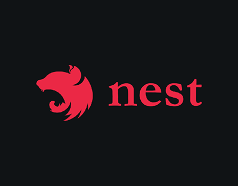

<div align="center">

</div>

<h1>O curso e projeto</h1>
No curso foi proposto a ideia organização de partidas entre jogadores. Sendo assim os jogadores podem fazer um solicitação de partida contra outro jogador da sua respectiva categoria, tendo ranking e historico das partidas realizadas. Assim fomos guiando em realizar esse sistema em diversos microserviços todos separdos em seu contexto e um intermediador que fica responsável em receber a requisição e mandar para o microserviço que vai trabalhar e logo em seguida devolver a resposta tratada.

<br>

> Um ponto importante é que algumas ferramentas utilizadas dentro do curso eram da AWS e consequentemente pagas ao longo do tempo. Para melhorar minha experiencia e conseguir utilizar o projeto ao longo do tempo sem me preocupar com custos, me permitir em substituir essas ferramentas para opções locais, como o RabbitMQ que foi utilizado localmente com Docker e etc.

<br>

<h1>👩‍💻Requisitos</h1>
- NodeJS
- RabbitMQ
- MongoDB

> Não deixe de instalar os requisitos, uma image docker para o RabbitMQ e o MongoDB já atende, mas fique ao seu criterio.

<h1>🧪Tecnologias Usadas</h1>

- [NODEJS](https://nodejs.org/en/)
- [NestJS](https://nestjs.com/)
- [MongoDB](https://www.mongodb.com/)
- [RabbitMQ](https://www.rabbitmq.com/)
- [JWT](https://jwt.io/)
- [FakerS3](https://github.com/jamhall/s3rver)
- [MailTrap](https://mailtrap.io/)
- [Mongoose](https://mongoosejs.com/)
- [TypeScript](https://www.typescriptlang.org/)

<br>

<h2>💬Como usar:</h2>

### Clonar o Projeto

```sh
$ git https://github.com/IgorSilvaZZ/curso-nestjs.git
$ cd curso-nestjs
```

### Instalar dependencias

> Nesse passo como temos diferentes microserviços isolados, temos que instalar a dependecia de cada projeto. Abaixo seguimos com os exemplos:

```sh
$ cd api-gateway
$ npm i
```

```sh
$ cd micro-admin-backend
$ npm i
```

```sh
$ cd micro-desafios
$ npm i
```

```sh
$ cd micro-rankings
$ npm i
```

```sh
$ cd micro-notificacoes
$ npm i
```

> Outro detalhe é que temos que instalar as dependencias o serviço do faker-s3, já que ele tem a finalidade de simular o funcionamento do serviço S3 da AWS.

```sh
$ cd faker-s3
$ npm i
```

### Rodar projeto

> Para rodar o projeto também seguimos o mesmo conceito da instalação em cada um temos que rodar o comando a baixo:

```sh
$ cd api-gateway
$ npm run start:dev
```

> O unico que diferencia dos demais microseriços é o serviço que simula a S3 da AWS.

```sh
$ cd faker-s3
$ npm start
```

<br>

Agora é só testar as aplicações em seu computador tudo localmente, sem precisar de serviços externos.

Entre na pasta [collection], aqui mesmo nesse repositorio e importe no seu tester de rotas HTTP de sua preferencia.

<h1>🧾Sobre</h1>

As aulas foram ministradas por [DFS Trainning](https://www.udemy.com/user/diego-fernandes-da-silva/) do curso [Node.js Microservices: NestJS, RabbitMQ and Cloud Services](https://www.udemy.com/course/construindo-um-backend-escalavel-com-nestjs-aws-e-pivotalws/).
